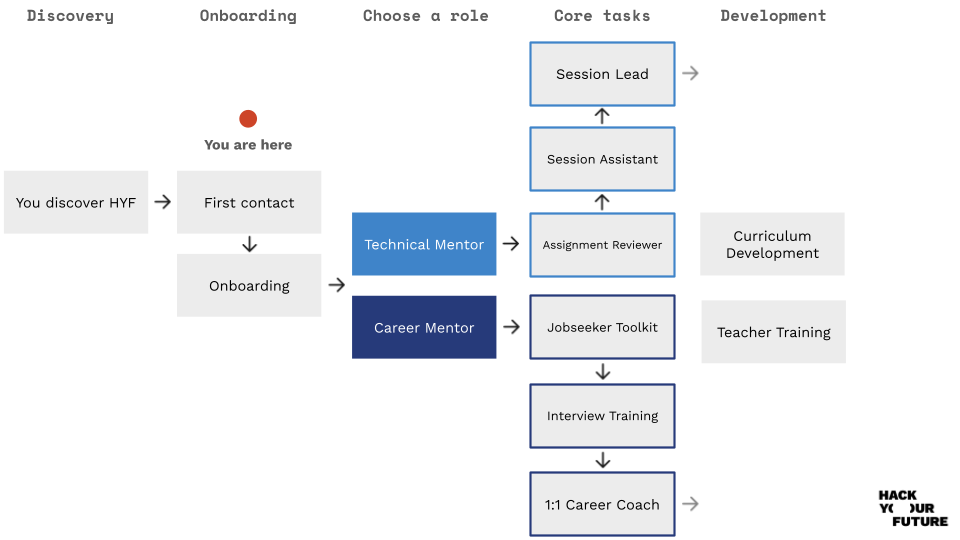

# 🎯 Getting Started

## Most crucial learning goals

We want our trainees to **be able to work in a tech company in Denmark**. Technical skills are important, but just as much is an understanding of what a real tech job looks like. Collaboration, teamwork, an inquisitive mindset and **asking tons of questions** are crucial _interpersonal skills_ that we want to encourage _over and over_. Relating what you explain in the sessions to your daily tasks at work is also _always_ super useful.

## Slack

Our Slack workplace is the **main communication tool we use**. The workspace has channels for every team of trainees. The main goal here is that we support trainees with questions/their assignments during the week. If you are not invited to Slack yet: Ask a staff member to add you 👨‍💻.

## FAQ

- Q: **How long do I have to commit as a volunteer?**\
  A: The duration of the module you are helping out with. ([see below](#so-how-is-the-program-structured)) However, there is no limitation to how many modules you want to be part of.
- Q: **How much time does mentoring require per week?**\
  A: It depends on the role, but aim at about 7-8 hours per week.
- Q: **Do I need to be a working professional to teach?**\
  A: No, you don't need to be a working professional, but it is a big plus. We want our trainees to learn from people who work with the technologies in our curriculum on a daily basis and know the challenges of the market.
- Q: **Will I be leading the workshops all by myself?**\
  A: No, the sessions are always run by a small group of volunteers. This allows for less pressure on the individual, split responsibility, and a broader perspective for our trainees.
- Q: **Do I have to teach exactly like it says in the curriculum?**\
  A: Not strictly. We have a clear curriculum with set learning goals and examples. The learning goals are the most important outcomes that you must help trainees reach by the end of the module. However, how you approach teaching those, specific materials you introduce or new ideas for exercises are always welcomed. Our curriculum is open-source, so you are welcome (and strongly encouraged!) to contribute to it with your own ideas. Check out our [Contributing guide](https://github.com/HackYourFuture-CPH/program/tree/main/contributing), if you're interested.
- Q: **When do the workshops take place?**\
  A: Sundays 12:00 - 16:00

## So how is the program structured?

When trainees sign up for HYF, they join our 8 month program which is split into two parts: a foundation course and a specialism course.

<figure><figcaption></figcaption></figure>

Each course is made up of a number of modules, and each modules is made up of learning goals, session plan, preparation materials and assignments.

For a full visual overview of the courses and their content, checkout out [our website](https://www.hackyourfuture.dk/apply) or dive into the content in the [Program repo](https://github.com/HackYourFuture-CPH/program).

As a mentor you can book a specific module where you are responsible for the team reaching the learning goals during that time. Ask the staff for the schedule and be proactive about saying what modules you would like to teach.

## Modules

- All modules have their own directory in the [Program repo](https://github.com/HackYourFuture-CPH/program).
- Check out the overview Readme under each course to see more details about the modules and content covered. Start with [Courses](https://github.com/HackYourFuture-CPH/program/tree/main/courses) if you want to look around.
- We divided everyone in our organization into GitHub teams, we have one for mentors, one for each trainee team etc. which all have different permissions.
- We have a private repository where fellow mentors share their [**teaching-tips-and-tricks**](https://github.com/HackYourFuture/teaching_tips_tricks), if you are new to teaching or are just curious on what they think works well in team, take a look.
- Please contribute and help improve the curriculum. Just make a Pull Request or share your feedback in slack ([#curriculum-crew](https://hackyourfuture-cph.slack.com/archives/C070USK1UET) is a good place to start).

## Workshops/Master Classes

From time to time we organize workshops (1 session) or Master Classes (5+ sessions) for our alumni in which we go into detail with a specific topic. We have so far organized Masterclasses & workshops on TypeScript, React Native, Serverless, .NET & C#, Web Bluetooth/Web USB, Data Analytics, Web Content Management & CMS Systems, Docker and many more. If you have a suggestion for a topic or want to build a lesson plan for a new Masterclass or workshop, please let us know!

## Roles

We distinguish between [Technical Mentors](../roles/technical-mentors/) & [Career Mentors](../roles/career-mentors/), but you can of course also be both. Technical Mentors are usually professional developers/working in tech, whereas Career Mentor roles sometimes only require expertise related to effective job-searching & interviewing for tech jobs.

## The Volunteer Journey

<figure><figcaption>
This is how new volunteers typically progress through volunteer roles at HYF.
</figcaption></figure>
