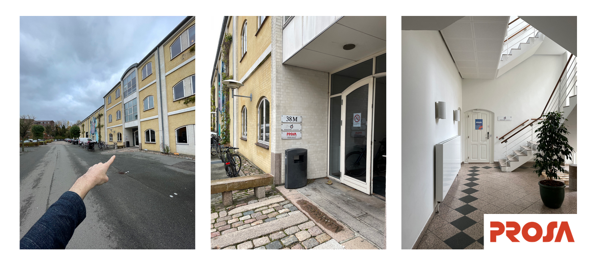

# 📍 Location: Aarhus

We host our onsite sessions on **Sundays** between **12:00 - 16:00** at the IT-Union [PROSA](https://www.prosa.dk/) who were so kind to provide their location for our workshops. The address is Søren Frichs Vej 38K th., DK-8230. If you are volunteering, please arrive by 11:45 so there's time to grab a coffee and get set up.&#x20;

<figure><figcaption>
How to find the back entrance when you are standing in front of the building.
</figcaption></figure>

There is parking available, but you will need to use the parking spots designated for PROSA or "Min A-Kasse" and use a parking coupon that we can provide upon arrival. \
\
The Busses 12 & 4A stop nearby and can take you there in about 15 minutes from Aarhus Central Station.

Please always give our staff a heads-up if you plan to swing by for a visit via aarhus@hackyourfuture.dk.\
\
Hope to see you soon!
