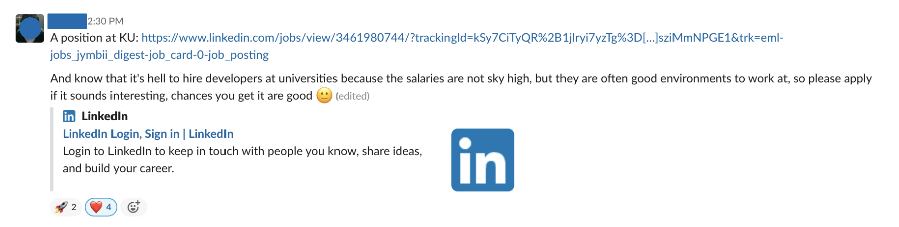

# Flexible tasks

There's _always_ something to do at HYF, but not always do availability and roles overlap perfectly for our volunteers, so here's an overview of what you can do when your schedule might not allow you to immediately commit to a 3-week module.

## #need-a-review

On our Slack workspace you can find a channel "**#need-a-review**" dedicated to assignment submissions from trainees that have not yet gotten reviewed. This task is basically the same as [Assignment Reviewer](homework-reviewer.md), just that it's not time-bound and you can focus on a single assignment submission, instead of several.

We estimate the time commitment to be between **30-60 minutes** here, as you would be using some time on understanding the exercises the trainee was trying to solve before you go in to add feedback to their code.

<figure><figcaption>
A trainee posting an assignment submission that hasn't gotten feedback after 7 days in the #need-a-review channel. 
</figcaption></figure>

Once an assignment submission has been posted in **#need-a-review** any volunteer can pick it up, so when you start reviewing the code, leave an emoji like 👍 so others know that you started working on it. Once you are finished, mark it with ✅.

## Sharing relevant job ads

If you stumble upon a suitable job posting for a role that could fit the skills of the HYF graduates - please post it in the **#jobs-jobs-jobs** channel or in the private **#alumni** channel, so job-seeking HYF trainees can see the opportunity and apply.

<figure><figcaption>
An example of a helpful post. An unconventional employer and a few lines explaining why it's a good opportunity.
</figcaption></figure>

Regularly posting job ads helps to calibrate the trainees' ability to select and apply for the right roles. In a perfect world, you would also offer to help those people who choose to apply with fine-tuning their applications to fit the company/role.

<figure><figcaption>
Another example of a simple post with some additional information.
</figcaption></figure>

## 1:1 Code Mentor

Some of our trainees struggle more than others to keep up with the high intensity of the program. If you are available for hopping on a video call for an hour per week, our staff can connect you to a struggling trainee who could use your guidance. In the calls, you would give feedback about their code and perhaps do some live trouble-shooting, but without solving assignments FOR the trainee. You and your mentee would organise the duration & cadence of the calls/meetings yourselves.

Let our staff know if you have a hard time getting in touch with the mentee.

## Career Mentoring

We group different volunteering roles that have to do with preparing our graduates for the job-market & landing their first job under this category. You can read more about all the different roles on the [Career Mentors](../career-mentors/) page.

A quick and simple way to help out is to check [the **#jobapplication-feedback-support** channel](https://app.slack.com/client/T428UGBJA/CQ5KGGN8H) and give feedback on the CVs posted in there.
